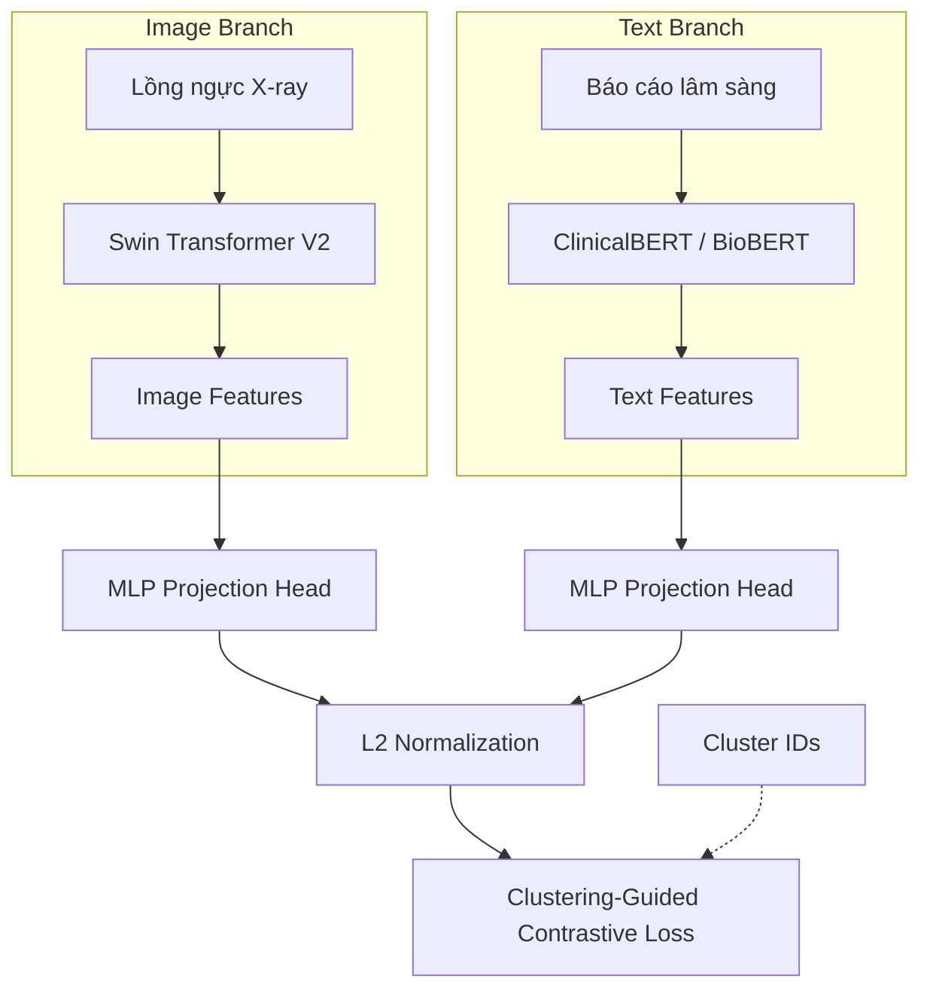

# Clustering-Guided Multimodal Negative Sampling

Dự án triển khai ý tưởng "Lấy mẫu âm tính dựa trên phân cụm đa phương thức" cho hệ thống biểu diễn Đặc trưng (Representation Learning) đối với dataset cặp Ảnh Y Tế - Báo cáo Y tế.

## Các tính năng chính (Tasks)
1. Xử lý tập dữ liệu cặp Image-Text với thông tin Nhóm/Cụm bệnh (Cluster_ID).
2. Xây dựng Kiến trúc mạng sử dụng Swin Transformer V2 và ClinicalBERT/BioBERT, qua MLP Projection layer.
3. Huấn luyện bằng Clustering-Guided Contrastive Loss nhằm giảm thiểu hiện tượng âm tính giả (False Negatives).

## Cách chạy
1. Cài đặt các requirements
   ```bash
   pip install -r requirements.txt
   ```
2. Chạy tiền xử lý dữ liệu và cấu hình tại `configs/default.yaml`.
3. Khởi chạy huấn luyện bằng script `scripts/train.py`.

pip install -r requirements.txt
$env:PYTHONIOENCODING="utf8"; python scripts\prepare_dataset.py
python scripts\create_clusters.py

ý tưởng fine-tunning
# Tài liệu Ý tưởng Hệ thống: Clustering-Guided Multimodal Representation Learning

Tài liệu này trình bày chi tiết về ý tưởng và phương pháp triển khai hệ thống học biểu diễn đặc trưng đa phương thức (ảnh và văn bản) cho dữ liệu Y tế, tập trung vào việc giải quyết bài toán **False Negatives** thông qua kỹ thuật **Clustering-Guided Negative Sampling**.

---

## 1. Đặt vấn đề: Bài toán False Negatives trong Y tế

Trong học máy đa phương thức truyền thống (như CLIP), mô hình học bằng cách kéo gần các cặp (Ảnh, Báo cáo) khớp nhau và đẩy xa các cặp không khớp. Tuy nhiên, dữ liệu Y tế có đặc điểm rất khác so với dữ liệu thông thường:

- **Sự đa dạng của mô tả**: Hai bệnh nhân khác nhau có thể cùng mắc một chứng bệnh (ví dụ: Viêm phổi - Pneumonia), dẫn đến hai báo cáo lâm sàng có nội dung gần như tương đương.
- **Hệ quả của Contrastive Learning truyền thống**: Nếu dùng hàm mất mát tiêu chuẩn, mô hình sẽ coi cặp (Ảnh A, Báo cáo A) là Positive, nhưng lại coi (Ảnh A, Báo cáo B) là Negative dù cả hai đều mô tả cùng một bệnh lý.
- **Hệ quả**: Việc ép mô hình phải "đẩy xa" các mẫu thực tế mang cùng ý nghĩa bệnh lý sẽ gây nhiễu, làm giảm khả năng học được các đặc trưng y sinh cốt lõi. Đây chính là hiện tượng **False Negatives**.

---

## 2. Ý tưởng cốt lõi: Phân cụm dẫn đường (Clustering-Guided)

Để giải quyết vấn đề trên, hệ thống triển khai ý tưởng **loại bỏ các mẫu âm tính giả** khỏi quá trình tính toán hàm mất mát dựa trên thông tin phân cụm bệnh lý.

### Quy trình logic:
1. **Phân cụm văn bản**: Trước khi huấn luyện, toàn bộ báo cáo y tế được chuyển thành vector (NLP Embedding) và gom nhóm bằng thuật toán K-Means. Mỗi nhóm đại diện cho một cụm bệnh lý tương đồng.
2. **Gắn nhãn Cụm (Cluster ID)**: Mỗi cặp dữ liệu (Anh, Text) sẽ mang một `cluster_id`.
3. **Mặt nạ Hàm mất mát (Loss Masking)**: Trong quá trình tính toán sự tương đồng giữa các mẫu trong một Batch, nếu hai mẫu khác nhau nhưng có cùng `cluster_id`, chúng sẽ bị loại bỏ khỏi các mẫu âm tính tham gia vào việc tính toán gradient đẩy.

---

## 3. Kiến trúc Hệ thống

Mô hình sử dụng hai nhánh Encoder mạnh mẽ nhất hiện nay để trích xuất đặc trưng:



- **Image Encoder**: **Swin Transformer V2**. Cơ chế Hierarchical Vision Transformer giúp nắm bắt các chi tiết bệnh lý nhỏ lẻ trên phim X-quang tốt hơn CNN truyền thống.
- **Text Encoder**: **ClinicalBERT**. Được huấn luyện sẵn trên hàng triệu ghi chú lâm sàng thực tế, giúp hiểu sâu các thuật ngữ y học phức tạp.
- **Projection Head**: Chuyển đổi các đặc trưng từ hai nhánh về cùng một không gian vector (Embedding Space) để tính toán tương quan.

---

## 4. Cơ sở Toán học

### 4.1. Độ tương đồng Cosine
Với cặp đặc trưng ảnh $f_i$ và đặc trưng văn bản $g_j$ trong một Batch có kích thước $N$:
$$s_{i,j} = \frac{f_i \cdot g_j}{\|f_i\| \|g_j\| \cdot \tau}$$
Trong đó $\tau$ (Temperature) là tham số dùng để điều chỉnh độ nhạy của hàm Softmax.

### 4.2. Định nghĩa tập âm tính giả (False Negatives)
Với mỗi mẫu $i$, tập hợp các chỉ số $j$ được coi là âm tính giả là:
$$\mathcal{FN}_i = \{j \mid i \neq j \land C_i = C_j\}$$
Trong đó $C$ là nhãn cụm (Cluster ID) đã được xác định ở bước tiền xử lý.

### 4.3. Hàm mất mát Clustering-Guided Contrastive Loss
Công thức hàm mất mát cho hướng Ảnh-sang-Văn bản (Image-to-Text) được định nghĩa lại để bỏ qua các thành phần trong tập $\mathcal{FN}_i$:

$$\mathcal{L}_{i}^{(I \to T)} = -\log \frac{\exp(s_{i,i})}{\sum_{j=1}^{N} \left[ \mathbb{1}(j \notin \mathcal{FN}_i) \cdot \exp(s_{i,j}) \right]}$$

> [!TIP]
> **Giải thích**: Bằng cách nhân $\exp(s_{i,j})$ với 0 khi $j \in \mathcal{FN}_i$, mô hình sẽ không bị phạt khi đặc trưng của ảnh $i$ và báo cáo $j$ (cùng cụm bệnh) gần nhau. Điều này cho phép hệ thống học được sự tương đồng giữa các ca bệnh cùng loại.

---

## 5. Quy trình thực hiện (Workflow)

Hệ thống được vận hành qua 3 giai đoạn chính:

1.  **Giai đoạn Tiền xử lý (Preprocessing)**:
    - Làm sạch và chuẩn hóa văn bản báo cáo.
    - Trích xuất nhúng văn bản bằng SBERT.
    - Chạy K-Means (ví dụ K=14 cho 14 nhóm bệnh chính của IU-Xray).
2.  **Giai đoạn Huấn luyện (Training)**:
    - Nạp `cluster_id` vào DataLoader.
    - Tính toán ma trận similarity trong từng Batch.
    - Áp dụng Mask dựa trên `cluster_id` để loại bỏ False Negatives.
    - Cập nhật trọng số thông qua Backpropagation.
3.  **Giai đoạn Đánh giá (Evaluation)**:
    - Kiểm soát độ chính xác thông qua các chỉ số Recall@K (R@1, R@5, R@10).
    - Kiểm tra khả năng gom cụm của không gian Embedding bằng t-SNE visualization.

---

## 6. Kết luận

Ý tưởng **Clustering-Guided Multimodal Negative Sampling** giúp mô hình thoát khỏi sự gò bó của việc so khớp 1-1 cứng nhắc, chuyển sang học các khái niệm bệnh lý trừu tượng. Đây là một hướng tiếp cận hiệu quả để tối ưu hóa việc học đại diện y tế trong điều kiện dữ liệu có tính tương đương bệnh lý cao.


